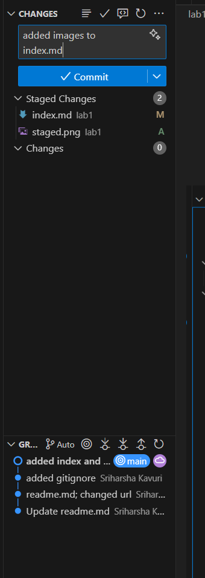
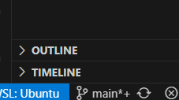
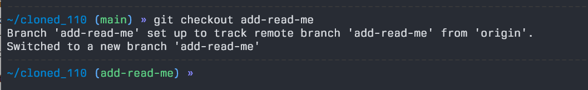
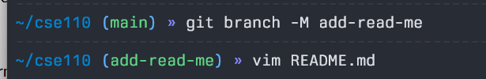
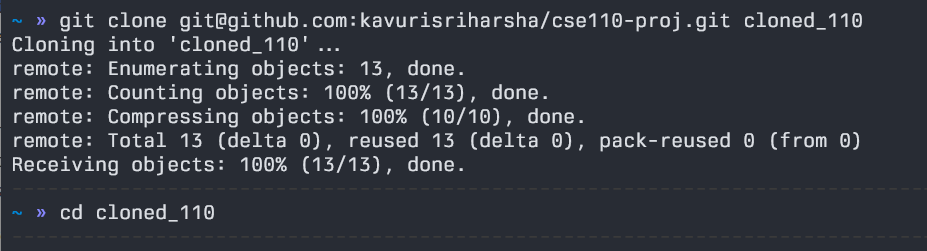
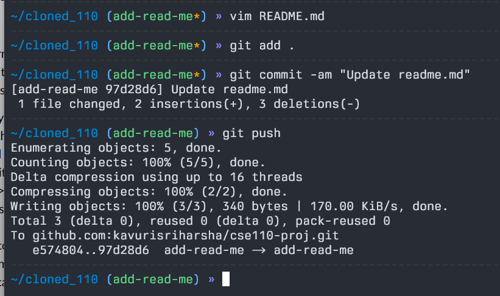

# Sriharsha's Homepage

## Second Level

### Third Level

#### **Bold**

##### *Italic*

###### ~~Strikethrough~~

`Inline code`

```bash
codeblock
```

> quote
> > nested quote

1. First item
   - Second item
     - Third item
  
[X] Check
[ ] Uncheck

[Google](https://www.google.com)

[img link](./screenshots/image.png)

[link to second level](#second-level)

- [x] #739
- [ ] https://github.com/octo-org/octo-repo/issues/740
- [ ] Add delight to the experience when all tasks are complete :tada:


# Pictures
- 
- 
- 
- 
- 
- 